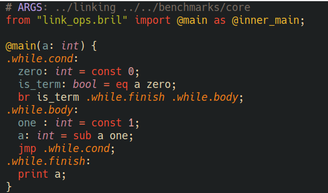

# Major mode for Bril text format

[](https://www.gnu.org/licenses/gpl-3.0)

Major mode for [Bril](https://capra.cs.cornell.edu/bril/) text format.

Supports syntax highlighting for core plus extensions: ssa, memory, floating
point, speculative execution, imports, and characters.



## Installing

### Install bril-mode.el from source

- Clone this repository
- Add the following to your emacs config

```elisp
(require 'bril-mode "[cloned nverno/bril-mode]/bril-mode.el")
```
